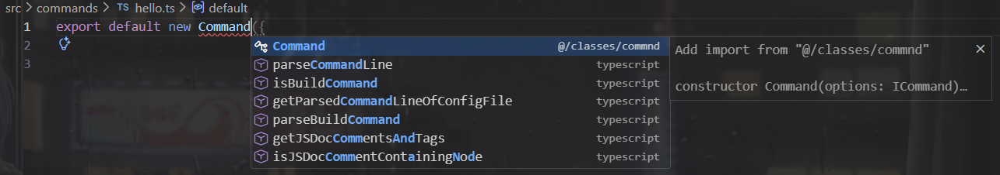
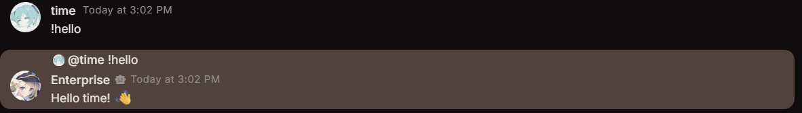
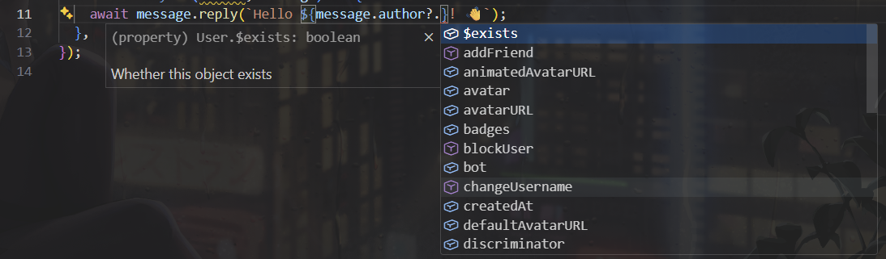

In this section, we will go over how to create commands for your bot. Commands are the main way users will interact with your bot.

The template comes with an example command called `ping`. You can find it in the `src/commands/ping.ts` file. This command will reply with the latency of the bot when a user types `!ping`.


## Structure

The template provides a `Command` class that you can use to create commands for your bot. You can find the `Command` class in the `src/classes/Command.ts` file.

Commands are created using the following structure:

```typescript
new Command({
  name: string;
  description?: string;
  aliases?: string[];
  cooldown?: number;
  permission: PermissionLevel;
  execute: (client: Client, message: Message) => Promise<any> | any;
});
```

### Understanding Each Property

Let's break down what each property means and how to use them:

#### `name` (required)

This is the name of your command. When a user types your command prefix followed by this name, the command will run.

**Example:** If command's name is `"hello"`, users will type `!hello` to run it.

#### `description` (optional)

A short explanation of what your command does. This helps users understand what the command is for and is often shown in help menus.

**Example:** `"Greets the user with a friendly message"`

#### `aliases` (optional)

Alternative names for the command. If you have a command called `"hello"`, you can add aliases like `["hi", "hey"]`. Users can type any of these names to run the same command.

**Example:** `aliases: ["hi", "hey", "greet"]` means users can type `!hi`, `!hey`, or `!greet` to run the `"hello"` command.

#### `cooldown` (optional)

Prevents the command from being used too frequently by the same person. The number is in **seconds**.

**Example:** `cooldown: 5` means each person can only use this command once every 5 seconds. This is useful for preventing spam.

#### `permission` (required)

Controls who is allowed to use the command. You must specify a `PermissionLevel`:

- `PermissionLevel.User` - Anyone can use it
- `PermissionLevel.Moderator` - Only moderators can use it
- `PermissionLevel.Admin` - Only server admins can use it
- `PermissionLevel.Owner` - Only the server owner can use it
- `PermissionLevel.BotOwner` - Only the bot owner (you) can use it

You can modify the permission levels in the `src/classes/command.ts` file.

**Example:** `permission: PermissionLevel.User` allows anyone to use the command.

#### `execute` (required)

This is the actual code that runs when someone uses the command. It receives:

- `client` - Your bot instance
- `message` - The message object that triggered the command

**Example:**

```typescript
execute: (client, message) => {
  message.reply("Hello, world!");
};
```

## Creating Your First Command

Let's create a simple `hello` command:

```typescript title="src/commands/hello.ts"
import { Command, PermissionLevel } from "@/classes/commnd";

export default new Command({
  name: "hello",
  description: "Greets you with a friendly message",
  aliases: ["hi", "hey"],
  cooldown: 3,
  permission: PermissionLevel.User,
  execute: async (client, message) => {
    await message.reply(`Hello ${message.author?.username}! 👋`);
  },
});
```

When someone types `!hello` (or `!hi` or `!hey`), the bot will reply with a greeting.

### Making the Command

1. Create a new file in `src/commands/` called `hello.ts`
2. Type the following code

```typescript title="src/commands/hello.ts"
export default new Command({});
```

You might've noticed that when you start typing `new Command`, you get suggestions for the properties you can add. This is called **intellisense**. You can press <kbd>Enter</kbd> or <kbd>Tab</kbd> to quickly add the properties you need.



3. Fill in the required properties

```typescript title="src/commands/hello.ts"
// [!code ++]
import { Command, PermissionLevel } from "@/classes/commnd";

export default new Command({
  // [!code ++:3]
  name: "hello",
  permission: PermissionLevel.User,
  execute: async (client, message) => {},
});
```

4. Add optional properties

```typescript title="src/commands/hello.ts"
import { Command, PermissionLevel } from "@/classes/commnd";

export default new Command({
  name: "hello",
  // [!code ++:3]
  description: "Greets you with a friendly message",
  aliases: ["hi", "hey"],
  cooldown: 3,
  permission: PermissionLevel.User,
  execute: async (client, message) => {},
});
```

5. Write your code in execute

```typescript title="src/commands/hello.ts"
import { Command, PermissionLevel } from "@/classes/commnd";

export default new Command({
  name: "hello",
  description: "Greets you with a friendly message",
  aliases: ["hi", "hey"],
  cooldown: 3,
  permission: PermissionLevel.User,
  execute: async (client, message) => {
    // [!code ++]
    await message.reply(`Hello ${message.author?.username}! 👋`);
  },
});
```

6. Save the file and test your command by running your bot and typing `!hello` in a server or DM.



### Explanation of the Code in `execute`

In the `execute` function, we use `message.reply()` to send a response back to the user who triggered the command. The message includes a greeting and the username of the person who used the command.

`message` is an object that contains information about the message that triggered the command, including the author, content, and more. By using `message.author?.username`, we can get the username of the person who sent the command.

The reason why we see a `?` after `author` is because the author might be `undefined`. The `?` prevents errors in case `author` is not available for some reason.

Visual Studio Code's intellisense will show you all the properties and methods available on the `message` object and add `?` when needed.


