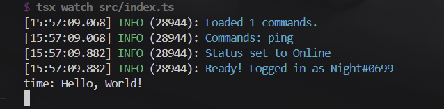

In this section, we will go over how to create events for your bot. Events are actions that happen on Stoat. Your bot can "listen" to these events and run code in response. Some common events include:

- **messageCreate** - Someone sends a message
- **messageReactionAdd** - Someone reacts to a message
- **ready** - Your bot successfully logs in
- **serverMemberJoin** - Someone joins the server

The template comes with example events in the `src/events/` folder.

## Structure

The template provides an `Event` class that you can use to create event handlers. You can find the `Event` class in the `src/classes/Event.ts` file.

Events are created using the following structure:

```typescript
new Event({
  name: T;
  description?: string;
  once?: boolean;
  execute: (...args: [client: Client, ...ClientEvents[T]]) => void | Promise<void>;
});
```

### Understanding Each Property

Let's break down what each property means and how to use them:

#### `name` (required)

The name of the Discord event you want to listen to. This has auto-complete, so your editor will suggest valid event names.

**Example:** `name: "messageCreate"`

#### `description` (optional)

A brief explanation of what this event handler does.

**Example:** `"Logs when new members join the server"`

#### `once` (optional)

If set to `true`, this event will only run **once**. If `false` or nothing is provided, it will run every time the event happens.

**Example:** `once: true` is useful for the `"ready"` event since you only need to run it once when the bot starts.

#### `execute` (required)

The code that runs when the event is triggered. The parameters you receive depend on the event type:

- `client` - Your bot instance (always the first parameter)
- `...args` - Event-specific data (varies by event)

**Example for messageCreate:**

```typescript
execute: (client, message) => {
  console.log(message.author.username + " sent a message");
};
```

This will log the username of anyone who sends a message in any server your bot is in.

## Creating Your First Event

Let's create a simple event that logs when someone sends a message:

```typescript title="src/events/messageCreateLog.ts"
import { Event } from "@/classes/event";

export default new Event({
  name: "messageCreate",
  description: "Logs every message sent in the server",
  execute: (client, message) => {
    console.log(`${message.author?.username}: ${message.content}`);
  },
});
```

When someone sends a message, the bot will log the username and the content of the message in the console.

### Making the Event

1. Create a new file in `src/events/` called `messageCreateLog.ts`
2. Type the following code

```typescript title="src/events/messageCreateLog.ts"
export default new Event({});
```

3. Fill in the required properties

```typescript title="src/events/messageCreateLog.ts"
// [!code ++]
import { Event } from "@/classes/event";

export default new Event({
  // [!code ++:2]
  name: "messageCreate",
  execute: (client, message) => {},
});
```

4. Add optional properties

<Callout>
  We do not need `once: false` because `false` is the default value for `once`.
</Callout>

```typescript title="src/events/messageCreateLog.ts"
import { Event } from "@/classes/event";

export default new Event({
  name: "messageCreate",
  // [!code ++]
  description: "Logs every message sent in the server or DM",
  execute: (client, message) => {},
});
```

5. Write your code in execute

```typescript title="src/events/messageCreateLog.ts"
import { Event } from "@/classes/event";

export default new Event({
  name: "messageCreate",
  description: "Logs every message sent in the server or DM",
  once: false,
  execute: (client, message) => {
    // [!code ++]
    console.log(`${message.author?.username}: ${message.content}`);
  },
});
```

6. Save the file and test your event by running your bot and sending a message in a server or DM. You should see the message logged in the console.


