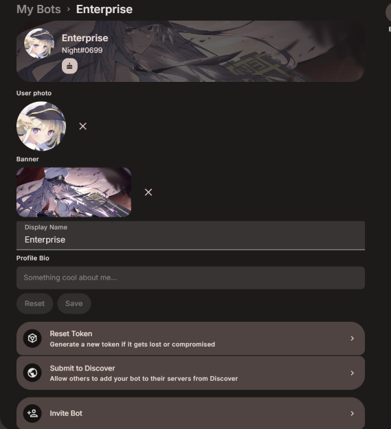
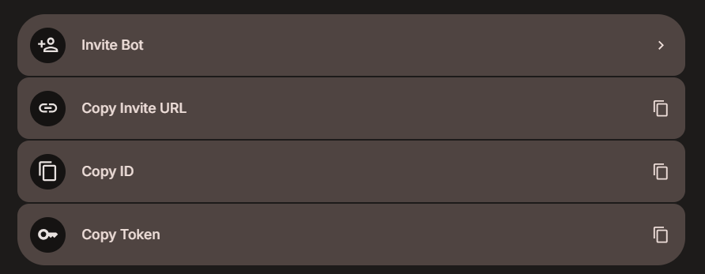
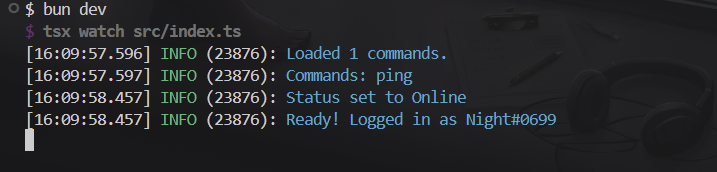
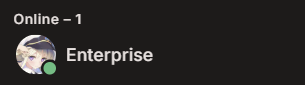
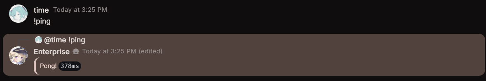

Now that you have the template set up, you can start creating your bot. Before you can start developing your bot, you need to create a bot on Stoat and get its token. In order to create a bot, you can follow these steps:

1. Open Stoat and click on the "Settings" icon on the bottom left.
2. Click on the "My Bots" tab.
3. Click on the "Create Bot" button.
4. Fill in the bot's name and click on the "Create" button.

After creating the bot, you should see a page like this:



## Getting the Bot Token

<Callout type="warn" title="Important">
  Never share your bot token with anyone. If has access to your bot token, they
  have full control over your bot.
</Callout>

<Callout title="Regenerating the Token">
  If you ever lose your bot token or suspect that it has been leaked, you can
  regenerate it by clicking on the "Reset Token" button above. This will
  invalidate the old token and generate a new one. Make sure to update your
  bot's configuration with the new token if you regenerate it.
</Callout>

On the same page where you created your bot, scroll down to the bottom. You should see a button that says "Copy Token". Click on that button to copy your bot token to your clipboard. You will need this token to start the bot.



## Inviting the Bot to Your Server

Before we start the bot, we should invite it to a server. Click on the "Invite Bot" button on the bot's page. This will open a popup where you can select a server to invite the bot to. Select a server and click on the "Add" button.

## Starting the Bot

Now that you have your bot token, you can start the bot. To start the bot, you need to set the `TOKEN` environment variable to your bot token. You can do this by editing the `.env` file in the root of your project. If you don't have a `.env` file, you can create one and add the following line to it:

```
TOKEN=your-bot-token-here
```

Make sure to replace `your-bot-token-here` with the actual token you copied.

After setting the `TOKEN` environment variable, you can start the bot by running the following command in your terminal:

```bash tab="npm"
npm run dev
```

```bash tab="yarn"
yarn dev
```

```bash tab="pnpm"
pnpm dev
```

```bash tab="bun"
bun dev
```

To stop the bot, you can press <kbd>Ctrl</kbd> <kbd>C</kbd> in your terminal or kill it.

Your bot should now be online! Try typing `!ping` in the server where you invited the bot. You should see the bot reply with "Pong!".






